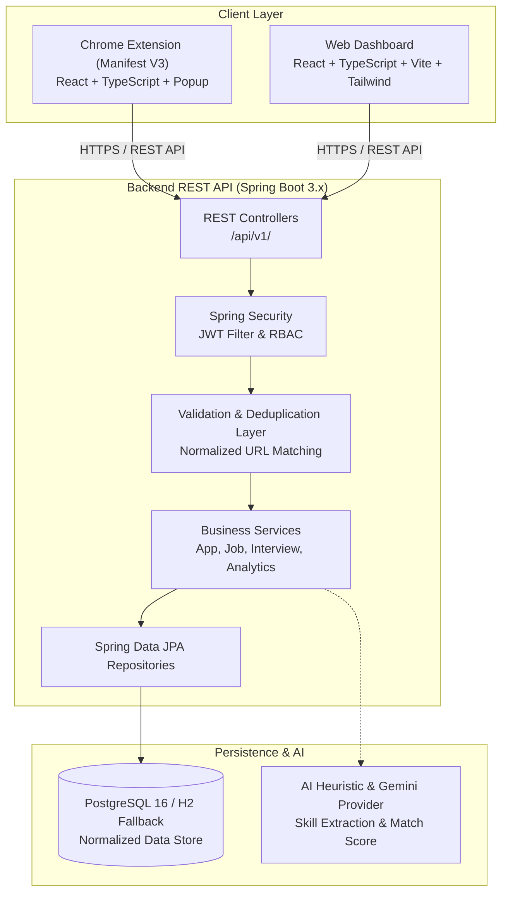
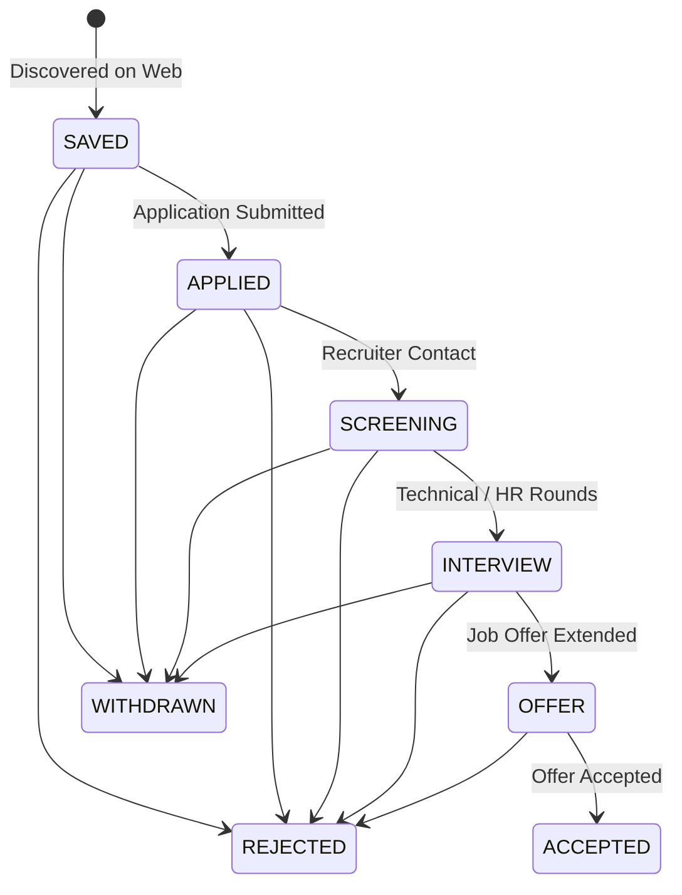

# JobTrack — AI-Powered Job Application Tracker

[](https://developer.chrome.com/docs/extensions/mv3/intro/)
[](https://spring.io/projects/spring-boot)
[](https://react.dev/)
[](https://www.typescriptlang.org/)
[](https://openjdk.org/)
[](https://www.postgresql.org/)
[](https://tailwindcss.com/)
[](https://opensource.org/licenses/MIT)

**JobTrack** is an intelligent, full-stack browser extension and web dashboard platform engineered to help software developers and job seekers discover, capture, track, and analyze job applications directly from job boards (LinkedIn, Indeed, Glassdoor, company career portals) with minimal manual data entry.

---

## 🚀 Live Production & Direct Download

| Service | Status | Description | Link |
| :--- | :--- | :--- | :--- |
| **Web Dashboard** | 🟢 Live | Production Management Interface | [https://jobtrack.antideploy.com](https://jobtrack.antideploy.com) |
| **Extension Showcase** | 🟢 Live | Public Download & Installation Guide | [https://jobtrack.antideploy.com/extension](https://jobtrack.antideploy.com/extension) |
| **Backend REST API** | 🟢 Live | Spring Boot 3 Cloud API | [https://jobtrack-api.antideploy.com](https://jobtrack-api.antideploy.com) |
| **Swagger UI Docs** | 🟢 Live | Interactive OpenAPI 3.0 Documentation | [Swagger UI](https://jobtrack-api.antideploy.com/swagger-ui/index.html) |
| **Actuator Health** | 🟢 Live | Application Health Probe (`UP`) | [Health Probe](https://jobtrack-api.antideploy.com/actuator/health) |
| **Extension ZIP** | 📦 v1.0.0 | Standalone Sideload Package ($0 Free) | [Download ZIP (.zip)](https://jobtrack.antideploy.com/downloads/jobtrack-extension.zip) |
| **Privacy Policy** | 📄 Public | Store-Compliant Privacy Terms | [https://jobtrack.antideploy.com/privacy](https://jobtrack.antideploy.com/privacy) |

---

## ✨ Core Features & Highlights

### 🧩 1. Smart Browser Extension (Manifest V3)
- **1-Click DOM Parsing**: Custom site-specific extractors for **LinkedIn Jobs**, **Indeed**, **Glassdoor**, and generic career portals with schema.org / JSON-LD fallback.
- **AI Match Scoring**: Heuristic & LLM-driven skill gap analysis comparing candidate qualifications against job requirements.
- **Bi-Directional Auth Synchronization**: Single Sign-On (SSO) token sharing between the Web Dashboard and Extension popup with zero re-logins.
- **Duplicate Detection**: Real-time normalization engine checks if a user has already applied to a posting.

### 📊 2. Comprehensive Web Management Dashboard
- **Interactive Kanban Pipeline**: Drag-and-drop application tracking across **Saved**, **Applied**, **Interviewing**, **Offer**, and **Rejected** stages.
- **Interview & Reminder Scheduler**: Integrated scheduling tool with date pickers, meeting notes, and timeline visualization.
- **Real-Time Analytics & Velocity**: Tracks application response rates, weekly activity trends, interview conversion metrics, and salary ranges.
- **Interactive Visual Installation Demo**: 15-second animated browser simulation on `/extension` and inside modal dialogs guiding users through setup.

### 🛡️ 3. Resilient Enterprise Cloud Backend
- **Spring Boot 3 & Java 21**: High-throughput REST API using Spring Data JPA, Hibernate 6, and HikariCP.
- **Dynamic Resilient Database Configuration**: Automatically supports Cloud PostgreSQL clusters, local Docker PostgreSQL, and gracefully falls back to embedded H2 file database (`./data/jobtrack_db`) for zero-config cold starts.
- **Stateless JWT Security**: HMAC-SHA384 signed tokens with configurable access/refresh lifecycles and role-based access control (RBAC).

---

## ⚡ 3-Step Quick Install for Users ($0 Free Sideloading)

Anyone can install the extension without paying Google Developer fees or waiting for store reviews:

1. **Download & Extract**: Download [**`jobtrack-extension.zip`**](https://jobtrack.antideploy.com/downloads/jobtrack-extension.zip) and extract it to a permanent folder on your computer.
2. **Open Extensions Page**: In Chrome, Edge, Brave, or Opera, navigate to `chrome://extensions` (or `edge://extensions`) and toggle **Developer mode** **ON** (top-right).
3. **Load Unpacked**: Click **Load unpacked** (top-left) and select the extracted folder. Pin the JobTrack icon to your toolbar!

---

## 🏛️ System Architecture

### High-Level Interaction Diagram



---

## 📡 REST API Reference

All endpoints are versioned under `/api/v1` and documentable via Swagger UI:

| Method | Endpoint | Access | Description |
| :--- | :--- | :--- | :--- |
| `POST` | `/api/v1/auth/register` | Public | Create new account with email & password |
| `POST` | `/api/v1/auth/login` | Public | Authenticate user and receive JWT tokens |
| `POST` | `/api/v1/auth/refresh` | Public | Refresh expired access token using refresh token |
| `POST` | `/api/v1/auth/google` | Public | Sign in or register via Google OAuth2 ID Token |
| `GET` | `/api/v1/applications` | Bearer Auth | List user applications with filters and pagination |
| `POST` | `/api/v1/applications` | Bearer Auth | Save new job application (auto-deduplicates job record) |
| `GET` | `/api/v1/applications/{id}` | Bearer Auth | Retrieve detailed application record with interviews |
| `PATCH` | `/api/v1/applications/{id}/status`| Bearer Auth | Update application pipeline stage (e.g. `INTERVIEWING`) |
| `DELETE`| `/api/v1/applications/{id}` | Bearer Auth | Remove application from pipeline |
| `GET` | `/api/v1/interviews` | Bearer Auth | Retrieve scheduled interviews for candidate |
| `POST` | `/api/v1/interviews` | Bearer Auth | Schedule interview for an active application |
| `GET` | `/api/v1/analytics/overview` | Bearer Auth | Retrieve response rates, stage distribution, velocity |
| `POST` | `/api/v1/ai/match-score` | Bearer Auth | Calculate skill match percentage against job specs |
| `POST` | `/api/v1/ai/cover-letter` | Bearer Auth | Generate custom cover letter for role |
| `GET` | `/actuator/health` | Public | Health probe endpoint for monitoring and PaaS orchestrators |

---

## ⚙️ Environment Configuration

### Backend (`backend/src/main/resources/application.yml` or Environment Variables)

| Variable | Default Value | Description |
| :--- | :--- | :--- |
| `PORT` / `SERVER_PORT` | `8080` | Port for Spring Boot web server |
| `DATABASE_URL` | *None* | Standard cloud connection string (`postgres://...` or `jdbc:postgresql://...`) |
| `DB_URL` | `jdbc:postgresql://localhost:5434/jobtrack_db` | Fallback PostgreSQL JDBC URL |
| `DB_USERNAME` | `postgres` | Database username |
| `DB_PASSWORD` | `postgres` | Database password |
| `JWT_SECRET` | `404E6352...` (256-bit Hex) | Secret key for signing HMAC-SHA JWT tokens |
| `JWT_ACCESS_EXPIRATION` | `604800000` (7 days) | Token lifespan in milliseconds |
| `CORS_ALLOWED_ORIGINS` | `http://localhost:5173,https://jobtrack.antideploy.com` | Whitelist for web and extension clients |
| `GEMINI_API_KEY` | *Optional* | Google Gemini API key for advanced generative AI |

### Web Frontend (`web/.env.production`)

| Variable | Production Value | Description |
| :--- | :--- | :--- |
| `VITE_API_BASE_URL` | `https://jobtrack-api.antideploy.com/api/v1` | Target endpoint for backend REST API |

### Chrome Extension (`extension/.env.production`)

| Variable | Production Value | Description |
| :--- | :--- | :--- |
| `VITE_API_BASE_URL` | `https://jobtrack-api.antideploy.com/api/v1` | Target endpoint for backend REST API |
| `VITE_WEB_BASE_URL` | `https://jobtrack.antideploy.com` | Target URL for opening the web dashboard |

---

## 📂 Repository Structure

```text
jobtrack/
├── extension/                  # Chrome Extension (Manifest V3)
│   ├── public/                 # Extension icons and build-ready manifest.json
│   ├── src/
│   │   ├── background/         # Background service worker (lifecycle & messaging)
│   │   ├── content/            # Isolated content scripts
│   │   │   └── extractors/     # Modular site adapters (LinkedIn, Indeed, Generic)
│   │   ├── popup/              # Fast capture popup interface (React + Tailwind)
│   │   └── types/              # Normalized extraction data contracts
│   ├── release/                # Generated store-ready zip packages (jobtrack-extension.zip)
│   ├── manifest.json           # Source Manifest V3 configuration
│   ├── package.json            # Extension scripts (build, package)
│   └── vite.config.ts          # Multi-entry rollup build for MV3
│
├── web/                        # Web Management Dashboard
│   ├── public/
│   │   ├── downloads/          # Downloadable assets (jobtrack-extension.zip)
│   │   └── videos/             # Drop-in location for user screen recordings
│   ├── src/
│   │   ├── components/         # Reusable UI widgets, modals, Kanban columns, VideoDemo
│   │   ├── pages/              # Dashboard, Kanban, Applications, Extension, Privacy
│   │   ├── layouts/            # App shell, sidebar navigation, extension promo card
│   │   ├── services/           # Axios REST API client & JWT token interceptors
│   │   └── types/              # Domain models (Job, Application, User)
│   ├── nginx.conf              # Production Nginx reverse proxy with SSL SNI
│   ├── Dockerfile              # Production Node -> Nginx multi-stage build
│   └── vite.config.ts          # Dashboard dev server & production bundler
│
├── backend/                    # Spring Boot 3.x REST API
│   ├── src/main/java/com/jobtrack/
│   │   ├── config/             # Resilient DatabaseConfig, Security, CORS, OpenAPI
│   │   ├── controller/         # REST Controllers (/api/v1/auth, /api/v1/applications)
│   │   ├── dto/                # Request & Response Data Transfer Objects
│   │   ├── entity/             # JPA Entities (User, Job, Application, Interview)
│   │   ├── enums/              # Controlled domain enums (Status, Type, Source)
│   │   ├── exception/          # Global Exception Handler & API error envelopes
│   │   ├── repository/         # Spring Data JPA repositories & custom queries
│   │   ├── security/           # JWT token provider & UserDetails implementation
│   │   └── service/            # Core business logic, deduplication & AI heuristics
│   ├── src/main/resources/
│   │   └── application.yml     # Centralized backend & database settings
│   ├── Dockerfile              # Production Temurin JRE 21 multi-stage container
│   ├── mvnw.cmd / mvnw         # Cross-platform Maven wrappers
│   └── pom.xml                 # Maven dependencies & build plugins
│
├── .github/
│   └── workflows/
│       └── release.yml         # Automated GitHub Actions release builder for extension zip
├── docker-compose.yml          # PostgreSQL containerized development environment
├── .gitattributes              # LF line-ending enforcement for shell scripts & wrappers
├── .gitignore                  # Production Git ignore rules
└── README.md                   # Project documentation
```

---

## 🔄 Application Lifecycle Stages



---

## 🛠️ Local Development Quick Start

### Prerequisites
- **Node.js**: v20+ (`v22` recommended)
- **Java**: JDK 21+ (`Java 21 LTS` or `22` verified)
- **Docker Desktop**: For running PostgreSQL locally

---

### 1. Start the PostgreSQL Database (Optional if using H2 fallback)
```bash
docker compose up -d
```
*PostgreSQL starts on port `5434` (mapped from 5432) with database `jobtrack_db`.*

---

### 2. Start the Backend API (Spring Boot)
```bash
cd backend
# Windows PowerShell
.\mvnw.cmd spring-boot:run

# Linux / macOS / Bash
./mvnw spring-boot:run
```
* The API starts at: `http://localhost:8080`
* Swagger UI Docs: `http://localhost:8080/swagger-ui.html`
* Health Endpoint: `http://localhost:8080/actuator/health`

---

### 3. Start the Web Dashboard (React)
```bash
cd web
npm install
npm run dev
```
* Access the Web Dashboard at `http://localhost:5173`.

---

### 4. Build and Package the Chrome Extension
```bash
cd extension
npm install
npm run package
```
* Compiles TypeScript and creates `release/jobtrack-extension.zip` in seconds.
* To load in Chrome: Navigate to `chrome://extensions`, enable **Developer mode**, and click **Load unpacked** pointing to `extension/dist`.

---

## 🧪 Testing & Verification

Run the comprehensive test suites before committing changes:

```bash
# Run backend JUnit 5 & Mockito test suite (20 tests)
cd backend
.\mvnw.cmd test

# Run web frontend production build
cd ../web
npm run build

# Run extension bundle & packaging test
cd ../extension
npm run package
```

---

## 🔒 Security & Best Practices

1. **Zero Client Trust**: All user authorization, input validation, and job deduplication are strictly verified on the server. Client requests cannot spoof `userId`.
2. **Resilient Data Fallback**: Automatic socket probe dynamically falls back from unreachable PostgreSQL instances to embedded file-based H2 databases without crashing container boot.
3. **Stateless JWTs & Safe Secrets**: No database credentials, JWT private keys, or external tokens are bundled in client distribution archives.
4. **Chrome Store Policy Compliant**: No remote code evaluation, strict single-purpose job capture scope, and comprehensive public privacy disclosures.

---

## 📄 License

This project is licensed under the **MIT License** — see the LICENSE file for details.
