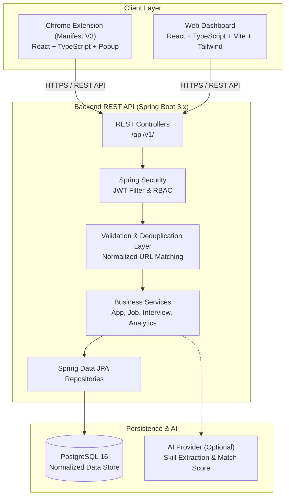
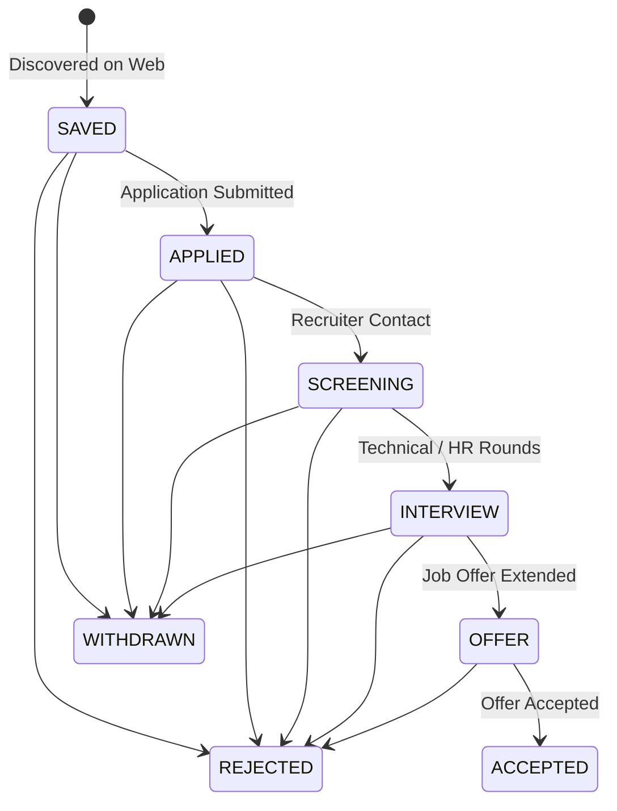

# JobTrack — AI-Powered Job Application Tracker

[](https://developer.chrome.com/docs/extensions/mv3/intro/)
[](https://spring.io/projects/spring-boot)
[](https://react.dev/)
[](https://www.typescriptlang.org/)
[](https://openjdk.org/)
[](https://www.postgresql.org/)
[](https://tailwindcss.com/)

**JobTrack** is an intelligent, full-stack browser extension and web dashboard platform engineered to help software developers and job seekers discover, capture, track, and analyze job applications directly from job boards (LinkedIn, Indeed, Glassdoor, company career portals) with minimal manual data entry.

---

## 🏛️ System Architecture

### High-Level Interaction Diagram



### Text Architectural Overview

```text
                          JOBTRACK SYSTEM
                                 │
              ┌──────────────────┴──────────────────┐
              ▼                                     ▼
       CHROME EXTENSION                       WEB DASHBOARD
     (React + TS + Vite)                   (React + TS + Vite)
     (Manifest V3 Popup &                   (Kanban, Analytics,
       Content Scripts)                      Application List)
              │                                     │
              └──────────────────┬──────────────────┘
                                 │ HTTPS (REST API)
                                 ▼
                        SPRING BOOT BACKEND
                     (Java 21/22 + Spring Boot 3)
                     (Auth, Security, Validation,
                      Deduplication, Analytics)
                                 │
                    ┌────────────┴────────────┐
                    ▼                         ▼
               POSTGRESQL                AI SERVICES
            (Docker / Cloud)          (Resume matching &
                                      skill analysis)
```

---

## 📂 Repository Structure

```text
jobtrack/
├── extension/                  # Chrome Extension (Manifest V3)
│   ├── public/                 # Extension icons and build-ready manifest.json
│   ├── src/
│   │   ├── background/         # Background service worker (lifecycle & messaging)
│   │   ├── content/            # Isolated content scripts
│   │   │   └── extractors/     # Modular site adapters (LinkedIn, Indeed, Generic)
│   │   ├── popup/              # Fast capture popup interface (React + Tailwind)
│   │   └── types/              # Normalized extraction data contracts
│   ├── manifest.json           # Manifest V3 configuration
│   ├── package.json            # Extension dependencies
│   └── vite.config.ts          # Multi-entry rollup build for MV3
│
├── web/                        # Web Management Dashboard
│   ├── src/
│   │   ├── components/         # Reusable UI widgets, modals, Kanban columns
│   │   ├── pages/              # Dashboard, Applications, Interviews, Analytics
│   │   ├── layouts/            # App shell, sidebar navigation, top header
│   │   ├── services/           # Axios REST API client & JWT token interceptors
│   │   └── types/              # Domain models (Job, Application, User)
│   ├── package.json            # Frontend dependencies
│   ├── tailwind.config.js      # Custom theme styling
│   └── vite.config.ts          # Dashboard dev server & production bundler
│
├── backend/                    # Spring Boot 3.x REST API
│   ├── src/main/java/com/jobtrack/
│   │   ├── config/             # Security, CORS, OpenAPI Swagger config
│   │   ├── controller/         # REST Controllers (/api/v1/auth, /api/v1/applications)
│   │   ├── dto/                # Request & Response Data Transfer Objects
│   │   ├── entity/             # JPA Entities (User, Job, Application, Interview)
│   │   ├── enums/              # Controlled domain enums (Status, Type, Source)
│   │   ├── exception/          # Global Exception Handler & API error envelopes
│   │   ├── repository/         # Spring Data JPA repositories & custom queries
│   │   ├── security/           # JWT token provider & UserDetails implementation
│   │   └── service/            # Core business logic, deduplication & ownership rules
│   ├── src/main/resources/
│   │   └── application.yml     # Centralized backend & database settings
│   ├── mvnw.ps1 / mvnw         # Cross-platform Maven wrapper
│   └── pom.xml                 # Maven dependencies & build plugins
│
├── database/                   # Database Infrastructure
│   ├── seed/01-init.sql        # PostgreSQL initial schema definition & indexes
│   └── README.md               # Database operational guide
│
├── docs/                       # Comprehensive Architecture & API Documentation
│   ├── PRD.md                  # Detailed Product Requirements Document
│   ├── ARCHITECTURE.md         # System Architecture & Layer Boundaries
│   ├── API.md                  # REST API v1 Contracts & Envelopes
│   ├── DATABASE.md             # ER Diagram & Table Dictionaries
│   ├── SECURITY.md             # Security Rules & JWT Lifecycle
│   └── DEPLOYMENT.md           # Production Deployment Guide
│
├── docker-compose.yml          # PostgreSQL containerized development environment
├── .env.example                # Environment variables template
├── .gitignore                  # Production Git ignore rules
└── README.md                   # Project documentation
```

---

## 🔄 Application Lifecycle Stages



---

## 🚀 Quick Start Guide

### Prerequisites
- **Node.js**: v20+ (`v24` recommended)
- **Java**: JDK 21+ (`Java 22` verified)
- **Docker**: Docker Desktop (for PostgreSQL)

---

### 1. Start the PostgreSQL Database
```bash
docker compose up -d
```
*Healthcheck verifies PostgreSQL is ready on port `5432` with database `jobtrack_db`.*

---

### 2. Start the Backend API (Spring Boot)
```bash
cd backend
# Windows PowerShell
.\mvnw.ps1 spring-boot:run

# Linux / macOS / Bash
./mvnw spring-boot:run
```
* The API starts at: `http://localhost:8080`
* Swagger UI Docs: `http://localhost:8080/swagger-ui.html`
* Health Endpoint: `http://localhost:8080/actuator/health`

---

### 3. Start the Web Dashboard (React)
```bash
cd web
npm install
npm run dev
```
* The Web Dashboard is accessible at `http://localhost:5173`.

---

### 4. Build and Load the Chrome Extension
```bash
cd extension
npm install
npm run build
```
1. Open Google Chrome and navigate to `chrome://extensions`.
2. Enable **Developer mode** in the top-right corner.
3. Click **Load unpacked** and select the `extension/dist` directory.

---

## 🔒 Security & Engineering Best Practices

1. **Zero Client Trust**: All user authorization, input validation, and deduplication are strictly enforced on the backend. Client payloads never dictate `userId`.
2. **Modular Extractor Interface**: Extractor adapters (`LinkedInExtractor`, `IndeedExtractor`, `CompanyCareerExtractor`, `GenericExtractor`) implement `JobExtractor` with resilient fallback to JSON-LD structured data and OpenGraph tags.
3. **Safe Secrets**: No database passwords, JWT secrets, or external AI keys are exposed in client bundles.
4. **Clean Code & Conventional Commits**: Layered separation between Presentation (React), Business Logic (Spring Boot Services), and Persistence (JPA + PostgreSQL).
